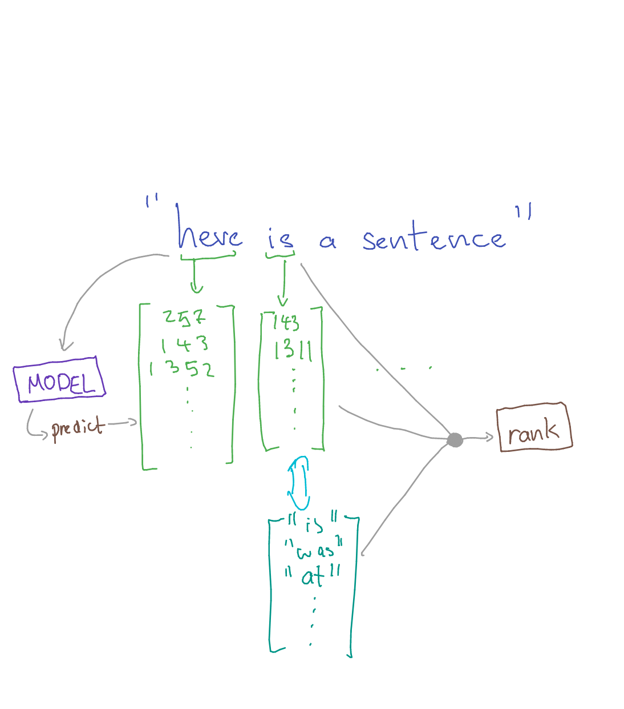

# butternut 
## `buh·tr·nuht` -- `bot or not?`

Is what you're reading online written by a human, or AI? Do the facts hold up? `butternut`is a chrome extension that leverages state-of-the-art text generation models *to combat* state-of-the-art text generation. 


## Inspiration
Misinformation spreads like wildfire in these days and it is only aggravated by AI-generated text and articles. We wanted to help fight back.

## What it does
Butternut is a chrome extension that analyzes text to determine just how likely a given article is AI-generated.

## How to install
1. Clone this repository.
2. Open your [Chrome Extensions](chrome://extensions)
3. Drag the `src` folder into the extensions page.


## Usage
1. Open a webpage or a news article you are interested in.
2. Select a piece of text you are interested in.
3. Navigate to the Butternut extension and click on it.
    3.1 The text should be auto copied into the input area. 
        (you could also manually copy and paste text there)
    3.2 Click on "Analyze".
4. After a brief delay, the result will show up.
5. Click on "More Details" for further analysis and breakdown of the text.
6. "Search More Articles" will do a quick google search of the pasted text.


## How it works
Butternut is built off the GLTR paper [https://arxiv.org/abs/1906.04043](https://arxiv.org/abs/1906.04043). It takes any text input and then finds out what a text generating model *would've* predicted at each word/token. This array of every single possible prediction and their related probability is crossreferenced with the input text to determine the 'rank' of each token in the text: where on the list of possible predictions was the token in the text.



Text with consistently high ranks are more likely to be AI-generated because current AI-generated text models all work by selecting words/tokens that have the highest probability given the words before it. On the other hand, human-written text tends to have more variety.

Here are some screenshots of butternut in action with some different texts. Green highlighting means predictable while yellow and red mean unlikely and more unlikely, respectively.

Example of human-generated text:


Example of GPT text:
. The salesforce CTRL model is used for butternut.


1. GPT-2: GPT-2 is a well-known general purpose text generation model and is included in the GLTR team's [demo repo](https://github.com/HendrikStrobelt/detecting-fake-text)
2. Salesforce CTRL: [Salesforce CTRL](https://github.com/salesforce/ctrl) (1.6 billion parameter) is bigger than all GPT-2 varients (117 million - 1.5 billion parameters) and is purpose-built for data generation. A custom backend was 

CTRL was selected for this project because it is trained on an especially large dataset meaning that it has a larger knowledge base to draw from to discriminate between AI and human -written texts. This, combined with its greater complexity, enables butternut to stay a step ahead of AI text generators.

## Design

Butternut was built with ease of use and simple design in mind. As a web extension that would be simple to use in passing but also access to further analysis if wanted.


## Challenges we ran into
- Deciding how to best represent the data
- How to design a good interface that *invites* people to fact check instead of being scared of it
- How to best calculate the overall score given a tricky rank distrubution

## Accomplishments that we're proud of
- Making stuff accessible: implementing a paper in such a way to make it useful **in under 24 hours!**

## What we learned 
- Using CTRL
- How simple it is to make an API with Flask
- How to make a chrome extension
- Lots about NLP!

## What's next?
Butternut may be extended to improve on it's fact-checking abilities
- Text sentiment analysis for fact checking
- Updated backends with more powerful text prediction models
- Perspective analysis & showing other perspectives on the same topic


Made with care by:


```json5
// our team: 
    'group_member_0': [brian chen](https://github.com/ihasdapie),
    'group_member_1': [trung bui](https://github.com/imqt),
    'group_member_2': [vivian wi](https://github.com/vvnwu),
    'group_member_3': [hans sy](https://github.com/hanssy130)
```


